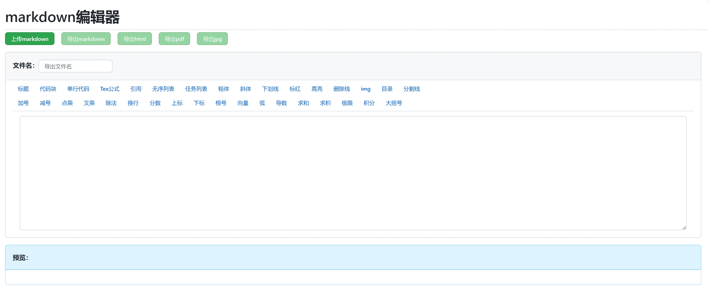

### 应用简介

- 超轻量应用，大小在2M以内
- 支持markdown上传、编辑、导出
- GitHub风格渲染
- 支持Tex公式
- 支持HTML语法
- 设置各种常用编辑按键，方便手机端操作
- 每次退出应用后自动保存内容，无需担心丢失

### 网页版

[https://markdown.xuqinyang.top/](https://markdown.xuqinyang.top/ )

### 应用下载

> ### Version 1.0.10

​	增加导出缩放设置功能

​	Download:  [app-release.apk](1.0.10/app-release.apk) 

> ### Version 1.0.9

​	优化PDF导出

​	Download:  [app-release.apk](1.0.9/app-release.apk) 

> ### Version 1.0.8

​	优化功能栏布局

​	Download:  [app-release.apk](1.0.8/app-release.apk) 

> ### Version 1.0.7

​	修复选择文件时直接退出后无法继续选择的问题

​	Download:  [app-release.apk](1.0.7/app-release.apk) 

> ### Version 1.0.6

​	新特性：关闭后仍保留内容

​	Download:  [app-release.apk](1.0.6/app-release.apk) 

> ### Version 1.0.5

​	1.0.4版本中未完全修复在相册中不显示问题，现已完全修复

​	Download:  [app-release.apk](1.0.5/app-release.apk) 

> ### Version 1.0.4

​	修复在相册中不显示问题

​	Download:  [app-release.apk](1.0.4/app-release.apk) 

> ### Version 1.0.3

​	将蓝色box换为灰色，减轻对jpg导出影响

​	Download:  [app-release.apk](1.0.3/app-release.apk) 

> ### Version 1.0.2

​	jpg默认导出到相册，其它默认导出到Download

​	Download:  [app-release.apk](1.0.2/app-release.apk) 

> ### Version 1.0.1

​	修复重复名称覆盖文件

​	修复不写文件名无法保存

​	Download:  [app-release.apk](1.0.1/app-release.apk) 

> ### Version 1.0.0

​	1.0.0

​	Download:  [app-release.apk](1.0.0/app-release.apk) 

